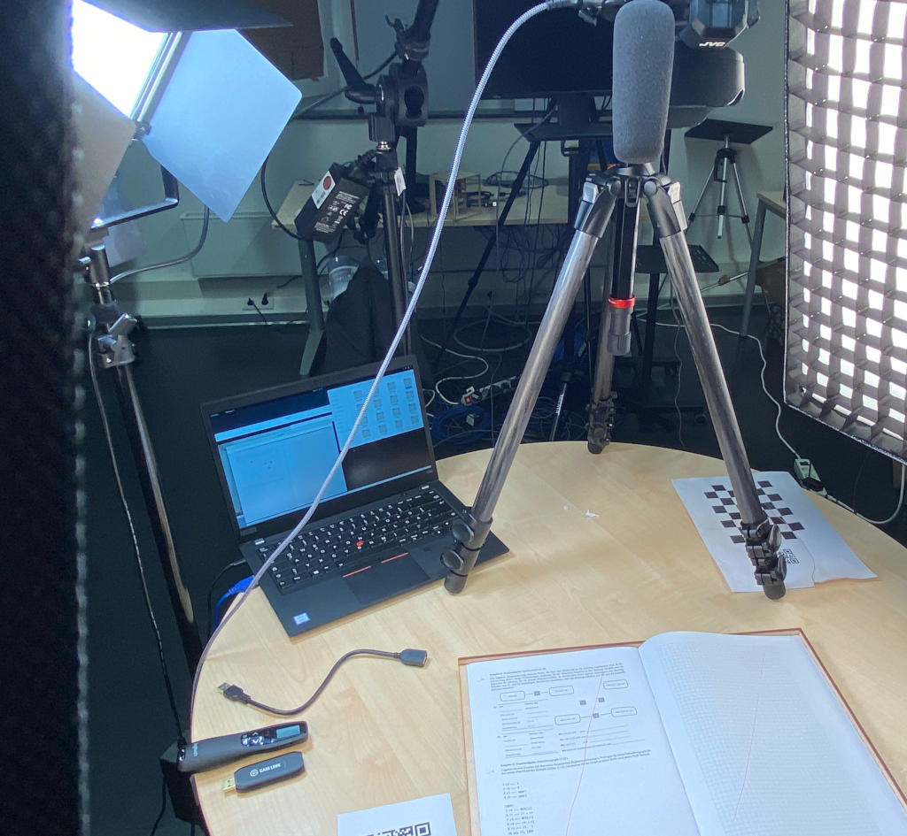

examscan
========

A simple camera based exam scanner for post-exam review. To start the scan
process, you put an exam thats is bounded on the left site on a specially
marked area (see left-pattern.pdf and right-pattern.pdf) together with an QR
code (see create-qrcodes.py) identifying the student. The software will use
motion detection to detect page turns and saves each page in an individual
image into the student's directory. Image perspective is corrected.

We used this software to provide our students with an inofficial post-exam
review after the official post-exam review has been canceled/postponed due
to rising infection rates during the Corona pandemic. To get an impression
how this looked like:

Unfortunately, there is no documentation. This code was written for internal
use only and requires someone who at least basically knows what to do. It was
created to get the job done and therefore did not receive proper code cleanup
etc. I just release it to the public "as is" in the hope that some might find
it useful and build upon it. If you have any questions, do not hesitate to
reach out (preferribly email: henning@hprid.de)

License: GPLv3
